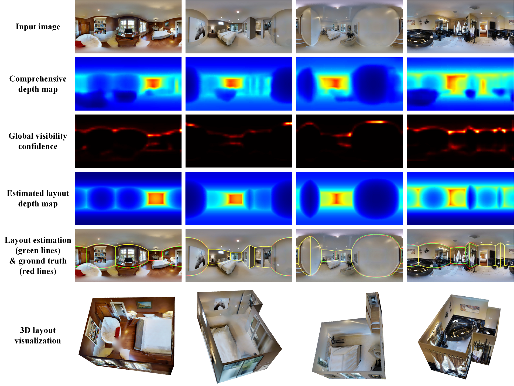
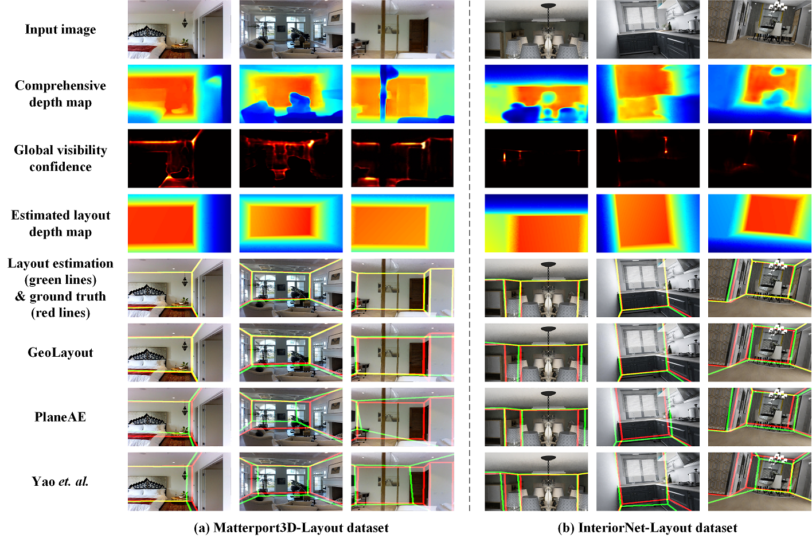

# C2P-Net：Comprehensive Depth Map to Planar Depth Conversion for Room Layout Estimation
This is PyTorch implementation of our paper "C2P-Net：Comprehensive Depth Map to Planar Depth Conversion for Room Layout Estimation".


Room layout estimation seeks to infer the overall spatial configuration of indoor scenes using perspective or panoramic images. As the layout is determined by the dominant indoor planes, this problem inherently requires the reconstruction of these planes. Some studies reconstruct indoor planes from perspective images by learning pixel-level or instance-level plane parameters. However, directly learning these parameters has the problems of susceptibility to occlusions and position dependency. In this paper, we introduce the Comprehensive depth map to Planar depth (C2P) conversion, which reformulates planar depth reconstruction into the prediction of a comprehensive depth map and planar visibility confidence. Based on the parametric representation of planar depth we propose, the C2P conversion is applicable to both panoramic and perspective images. Accordingly, we present an effective framework for room layout estimation that jointly learns the comprehensive depth map and planar visibility confidence. Due to the differentiability of the C2P conversion, our network autonomously learns planar visibility confidence by constraining the estimated plane parameters and reconstructed planar depth map. We further propose a novel approach for 3D layout generation through sequential planar depth map integration. Experimental results demonstrate the superiority of our method across all evaluated panoramic and perspective datasets.

# Code

## C2P-panoramic (Panoramic Images)

This folder contains code and scripts related to panoramic images.

### Evaluation

You can evaluate the model on the following datasets by running the corresponding commands:

- **MatterportLayout dataset**

```bash
python test.py --src '/home/ps/data/Z/matterport_dataset/test/image/' --config 'config/config_mp3d.yaml'
```

## C2P-perspective (Perspective Images)

This folder contains code for perspective images.

Training and Evaluation Instructions

1. Training

```bash
python train.py
```

2. Evaluate the trained model

```bash
python test.py
```

3. Post-processing and Visualization

Use mp3d_visio.m in MATLAB to process and visualize the test results.

Environment

Python 3.7

# Pretrained Models

The pretrained models are stored on Google Drive due to large file sizes.

| Model Name | Download Link |
|------------|----------------|
| C2P-panoramic Models |
  | trained_model |
  | `matterport.pth.tar` | [Download](https://drive.google.com/file/d/1U-6uPH6xPEDmi6Um7v0qXnwVq3kC6fYS/view?usp=drive_link) |
  | `pano.pth.tar`       | [Download](https://drive.google.com/file/d/16y3N-KJdXrWxJoZ80CGxh9V65oNoS4Hl/view?usp=drive_link) |
  | `stanford.pth.tar`   | [Download](https://drive.google.com/file/d/1VSA4-i6wJMNsvDZrt2WD9tucrwKSawD5/view?usp=drive_link) |
  | `zind.pth.tar`       | [Download](https://drive.google.com/file/d/1WwQ89prubzSwKr8O1WaZLY1WRKGzMVkE/view?usp=drive_link) |
  | pretrained_model |
  | `swin_large_patch4_window7_224_22k.tar`       | [Download](https://drive.google.com/file/d/1FWpnsrRur1xOu6hOf3ClO-t9TGCY9aiX/view?usp=drive_link) |
  
|------------|----------------|
| C2P-perspective Models |
  | trained_model |
  | `matterport_model.tar` | [Download](https://drive.google.com/file/d/15LE66F9osi9OZ2tmz0_AxqkP8ygJmscf/view?usp=drive_link) |
  | `model_interior.pth.tar`       | [Download](https://drive.google.com/file/d/1dEfYAjziy1uZrPHeIewTVa8fSKnkrMoQ/view?usp=drive_link) |
  | `model_lsun.pth.tar`   | [Download](https://drive.google.com/file/d/11-T_FO2Mm0WyXFeOEds1nWkcgS5c67-3/view?usp=drive_link) |
  | `model_nyu.pth.tar`       | [Download](https://drive.google.com/file/d/1jDCt1ppuHQ8fnKLrTIOXF-LKkyjlbNWk/view?usp=drive_link) |


You can download all models and place them into:
- `C2P-panoramic/trained_model/`
  `C2P-panoramic/pretrained_model/swin_transformer/`
- `C2P-perspective/trained_model/`

# Visual results
#### Panoramic-image-based layout estimation


#### Perspective-image-based layout estimation


# Contact
Email | chluzhre@gmail.com, davidzhang@sdu.edu.cn

